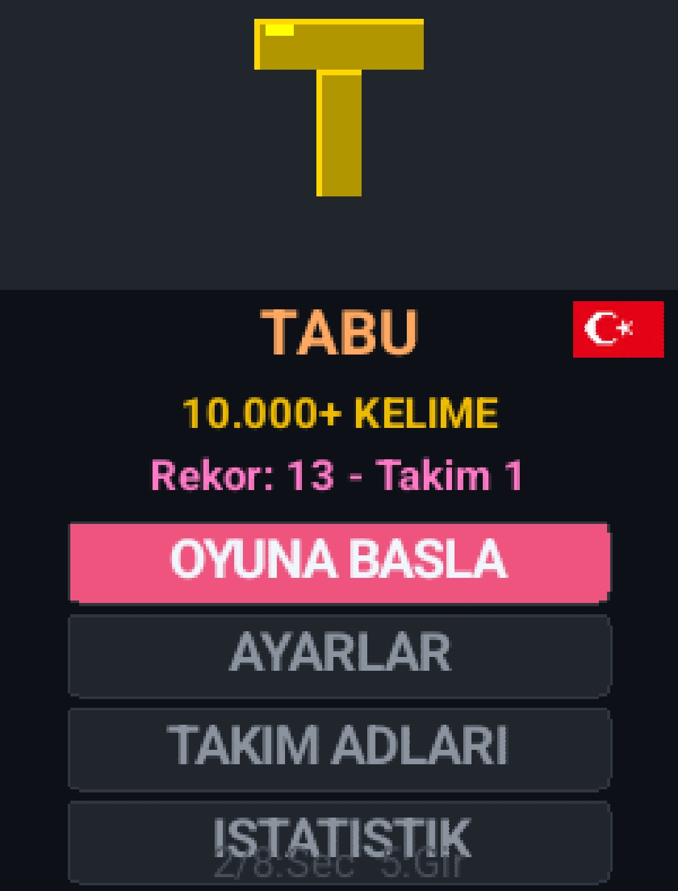
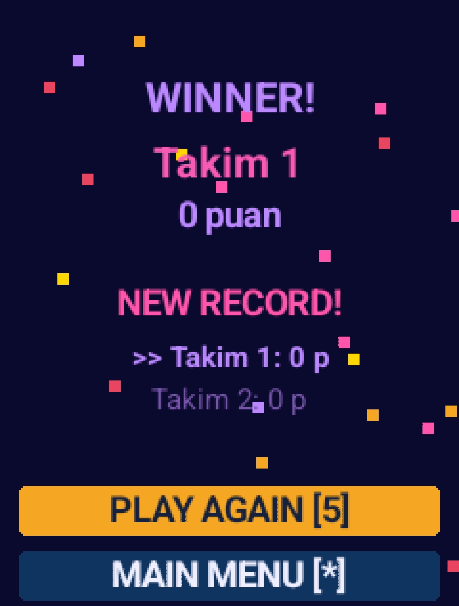
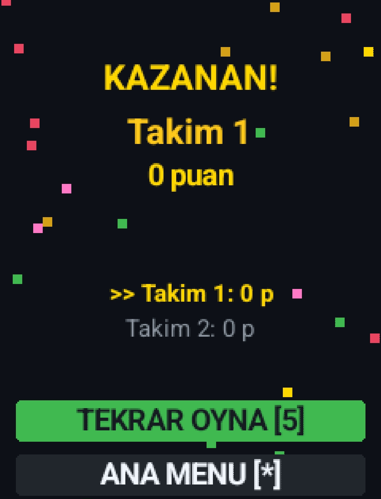
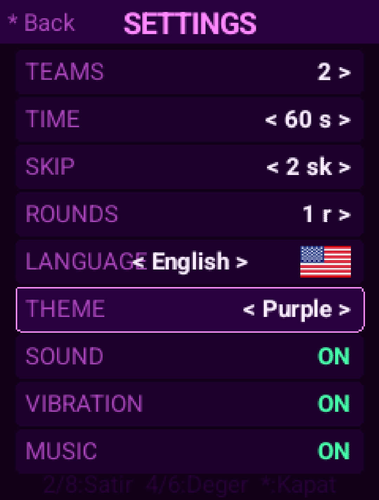
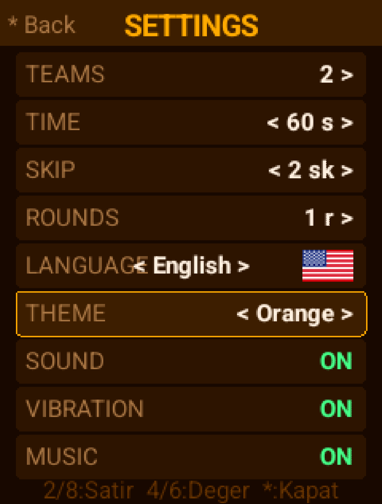
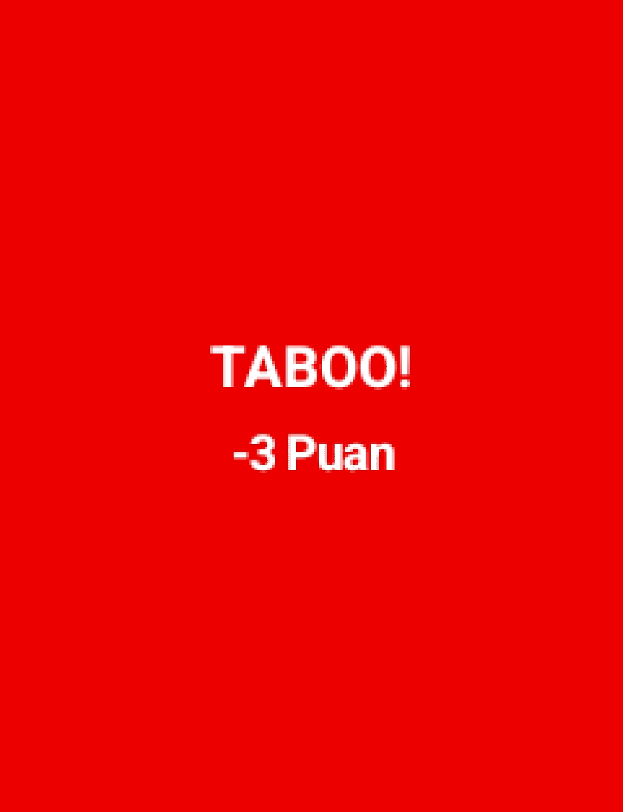

# 

# Tabu — J2ME Word Game v22.01

A Turkish/English Tabu word game built for Nokia and classic Java phones.



---

## 📱 Compatibility

- **Platform:** J2ME (MIDP-2.0 / CLDC-1.1)
- **Tested On:** Nokia 6303i, J2ME Loader (Android)
- **JAR Size:** ~200KB

---

## 🎯 How to Play

1. **Start Game** → Select deck → Ready screen → Press **5** to begin
2. The speaker describes the card without saying the forbidden words
3. **5** = Correct (+1 pt) | **1** = Taboo (-3 pts) | **3** = Skip
4. Round ends when time runs out, next team takes over
5. Most points wins!

---

## 🃏 Card Categories

### Turkish
| Category | Description |
|----------|-------------|
| Mix | Classic mixed cards (800 cards) |
| Kış | Winter / snow / ice themed |
| Bahar | Spring / flowers / nature |
| Tatil | Travel / beach / vacation |
| Gece Yarısı | Nightlife / party themed |
| Ünlüler | Famous people |
| Genel Kültür | Science / art / history |

### English
| Category | Description |
|----------|-------------|
| Mix | Classic mixed cards |
| Winter | Snow / ice / winter themed |
| Spring | Flowers / nature / spring |
| Holiday | Travel / beach / vacation |
| Midnight | Nightlife / party themed |
| Celebrities | Famous people |
| General Knowledge | Science / art / history |

---

## 🎮 Controls

| Key | In Game | In Menu |
|-----|---------|---------|
| **5 / Center** | ✅ Correct (+1) | Select / Enter |
| **1 / Left** | ❌ Taboo (-3) | — |
| **3 / Right** | ⏭ Skip | — |
| **2 / Up** | — | Up |
| **8 / Down** | — | Down |
| **\*** | Stop / Back | Back |
| **Right soft key** | Back | Back |

---

## ⚙️ Settings

| Setting | Options |
|---------|---------|
| Teams | 2–6 teams |
| Time | 30 / 45 / 60 / 90 / 120 sec |
| Skip | 0 / 1 / 2 / 3 / 5 / Unlimited |
| Rounds | 1 / 2 / 3 / 4 / 5 / Unlimited |
| Language | Turkish / English |
| Theme | 16 themes |
| Sound | On / Off |
| Vibration | On / Off |
| Music | On / Off |

---

## 🎨 Themes (16)

| # | Turkish | English |
|---|---------|---------|
| 1 | Koyu | Dark |
| 2 | Pembe K. | Pink Dark |
| 3 | Pembe A. | Pink Light |
| 4 | Mavi | Blue |
| 5 | Turuncu | Orange |
| 6 | Orman | Forest |
| 7 | Mor | Purple |
| 8 | Sarı | Yellow |
| 9 | Buz | Ice |
| 10 | Alev | Flame |
| 11 | Okyanus | Ocean |
| 12 | Altın | Gold |
| 13 | Neon | Neon |
| 14 | Galaksi | Galaxy |
| 15 | Günbatımı | Sunset |
| 16 | Türkiye 🇹🇷 | Turkey 🇹🇷 |

---

## 🐛 Debug Mode

Enter the **Konami code** on the D-Pad from the main menu:

```
↑ ↑ ↓ ↓ ← → ← →
```

Then press **#** → Browse all 263 emoji sprites.

---

## 📊 Statistics

- Total correct / taboo / skip counts
- High score and record team name
- Last 5 games history
- Press **#** on stats screen to reset

---

## 📸 Screenshots

| | | |
|--|--|--|
|  |  |  |
|  |  |  |

---

## 🔧 Build (Termux)

```bash
# Compile
javac -source 8 -target 8 -classpath midp.jar -d build/classes \
  src/tabu/TabuData.java src/tabu/EngData.java \
  src/tabu/EmojiData.java src/tabu/EmojiDataEN.java \
  src/tabu/GameCanvas.java src/tabu/TabuMIDlet.java

# Package
jar cfm TurkceTabu.jar META-INF/MANIFEST.MF -C build/classes . logo.png tr.png en.png music.mid e/
java -jar proguard-7.3.2/lib/proguard.jar @proguard.pro
jar xf TurkceTabu_verified.jar
for f in tabu/*.class; do
  printf '\xca\xfe\xba\xbe\x00\x00\x00\x2e' | dd of=$f bs=1 count=8 conv=notrunc 2>/dev/null
done
jar cfm TurkceTabu_final.jar META-INF/MANIFEST.MF tabu/*.class logo.png tr.png en.png music.mid e/
```

---

## 📁 Project Structure

```
├── src/tabu/
│   ├── TabuMIDlet.java      # Main MIDlet
│   ├── GameCanvas.java      # Game engine (all screens)
│   ├── TabuData.java        # Turkish card data (1170 cards)
│   ├── EngData.java         # English card data (1066 cards)
│   ├── EmojiData.java       # Turkish emoji mapping
│   └── EmojiDataEN.java     # English emoji mapping
├── e/                       # 283 emoji sprites (8x8 PNG)
├── screenshots/             # App screenshots
├── META-INF/MANIFEST.MF
├── logo.png
├── tr.png / en.png          # Flag images
└── music.mid                # Background music
```

---

## ⚠️ Technical Notes

- `StringBuilder` / `StringBuffer` **NOT ALLOWED** (CLDC incompatible)
- `Math.random()` replaced with `new Random()`
- All string concatenation uses custom `cat()` method
- Emoji scaling is pixel-based (no `drawRegion` in J2ME)
- Bytecode version patched to `0x2E` for Nokia compatibility

---

## 👤 Author

**UmutK** — 2026  
License: MIT
